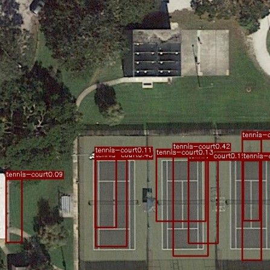
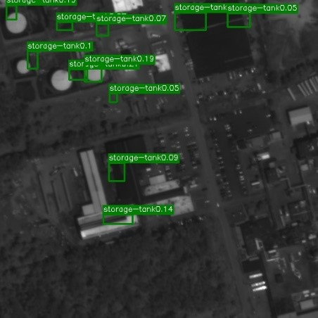
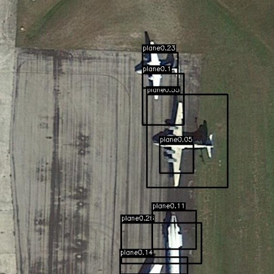
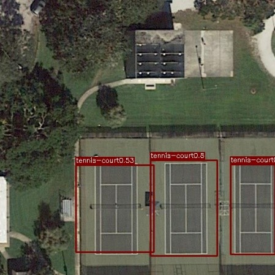
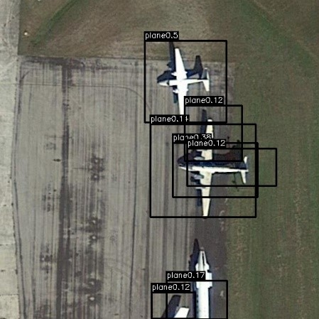
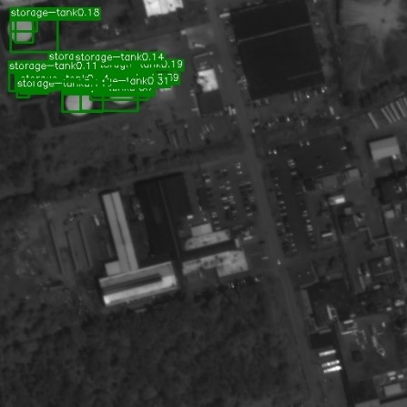

# HW2 ― Object Detection

Model: Yolov1

## Demonstration


<table>
<caption><h3>Using naive model</h3></caption>
<tr>
    <td></td>
    <td></td>
    <td></td>
</tr>
</table>

<table>
<caption><h3>Using improve model</h3></caption>
<tr>
    <td></td>
    <td></td>
    <td></td>
</tr>
</table>

## How to use

1. Download dataset

    ```
    bash get_dataset.sh
    ```

2. Download pretrained model and inference

    ```
    bash hw2.sh
    ```

3. Download pretrained improved model and inference

    ```
    bash hw2_best.sh
    ```

## Requirements

Because I have reconstructed the project using tensorboard (pytorch-1.4.0~), so it's not compatiable in older version.

## More Information

Please read [requirement](./REQUIREMENT.md) to get more information about this HW.

## Performance Report

### Question 1: Architecture and Hyperparameters

Model structure

```
Input size: (3, 448, 448)
Layer: 
    VGG16-bn: (512, 7, 7) 
    Flatten-layer: (25088) 
    Fully Connected: (4096) 
    LeakyReLU(0.02): (4096) 
    Dropout(0.5): (4096) 
    Fully Connected: (1274) 
    Sigmoid: (1274) 
    Reshape: (7, 7, 26)
```

Hyperparameters

- Optimizer: SGD 
- Batch Size: 16 
- Momentum: 0.9 
- Weight Decay: 1e-4 
- Learning Rate: 
  - (1-20 Epoches) 1e-3 
  - (21-40 Epoches) 1e-4 
  - (41-55 Epoches) 1e-5 
  - (56+ Epoches) 1e-6
- Non-maximum supression
  - Keep bounding box: 0.05 (Keep when P(class) > 0.05) 
  - IOU threshold: 0.5 (Remove when IOU > 0.5)

Augmentation:
- Random Horizon Flip
- Random Zoom In (x1.1) and crop

Final Result:

### Question 3: Improve Architecture and Hyperparameters

Model structure

```
Input size: (3, 448, 448)
Layer: 
    VGG16-without Maxpooling: (512, 14, 14)
    Conv2D(size=1) (26, 14, 14) 
    Sigmoid: (5096) 
    Reshape: (14, 14, 26)
```

Hyperparameters

- Optimizer: SGD 
- Batch Size: 16 
- Momentum: 0.9 
- Weight Decay: 1e-4 
- Learning Rate: 1e-3 
- Non-maximum supression
  - Keep bounding box: 0.05 (Keep when P(class) > 0.05) 
  - IOU threshold: 0.5 (Remove when IOU > 0.5)

Augmentation:
- Random Horizon Flip
- Random Vertical Flip

Final Result:

### Question 5: mAP score

|  Model  | mAP score |  IoU  | $P_{min}$ |
| :-----: | :-------: | :---: | :-------: |
|  basic  |  10.55%   |  0.5  |   0.05    |
| improve |  11.76%   |  0.5  |   0.05    |

### Question 6: Statistic of Dataset

|      Category      | Final AP (Base) | Final AP (Improve) | Number in train15000 |
| :----------------: | :-------------: | :----------------: | :------------------: |
|       Plane        |     21.01%      |       35.75%       |         8723         |
|  Baseball-diamond  |     16.67%      |       15.58%       |         515          |
|       Bridge       |      1.14%      |       0.56%        |         2114         |
| Ground-track-field |      9.09%      |        0.0%        |         621          |
|   Small-vehicle    |      0.38%      |       9.09%        |        116228        |
|   Large-vehicle    |      9.09%      |       18.26%       |        23746         |
|        Ship        |      2.7%       |       14.27%       |        34585         |
|    Tennis-Court    |     36.48%      |       52.36%       |         3279         |
|  Basketball-court  |     14.54%      |       18.18%       |         661          |
|    Storage-tank    |      9.09%      |       10.08%       |         5199         |
| Soccer-ball-field  |     32.32%      |        0.0%        |         590          |
|     Roundabout     |      0.0%       |       1.13%        |         537          |
|       Harbor       |      7.20%      |       2.28%        |         7457         |
|   Swimming-pool    |      9.09%      |       10.56%       |         1977         |
|     Helicopter     |      0.0%       |        0.0%        |         434          |
|  Container-crane   |      0.0%       |        0.0%        |         136          |
